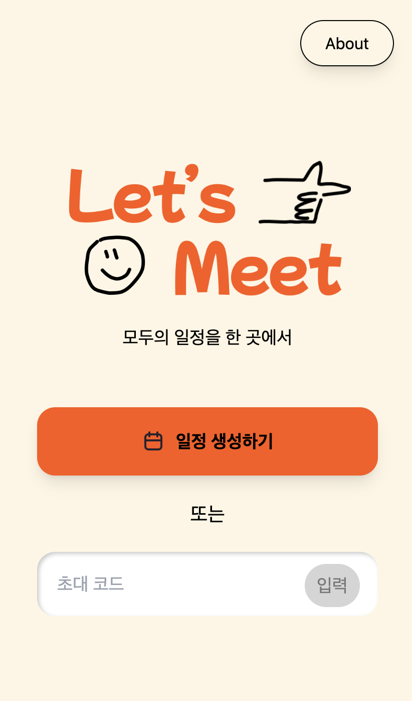
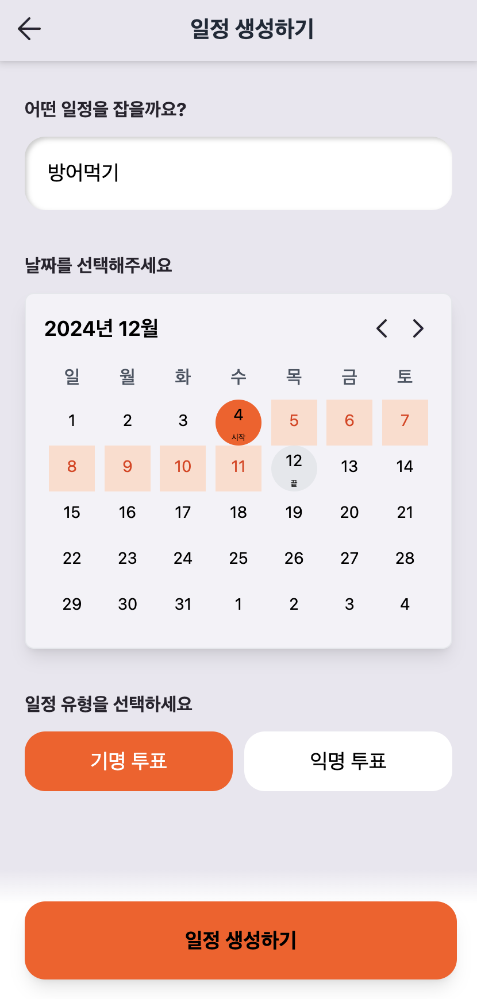
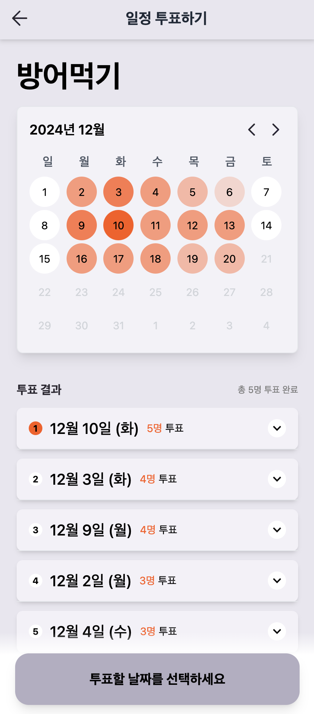

# 렛츠밑

## 📝 프로젝트 소개

렛츠밑은 사용자들이 쉽게 일정을 생성해서 잡을 수 있는 앱입니다.

## 🔗 링크
https://letsmeet.kr/

## 🛠 기술 스택

### Frontend

- React
- TypeScript
- Next.js
- Tailwind CSS
- React Query

## 🔍 사용하기

- 일정을 생성합니다.
- 링크로 일정을 공유합니다.
- 일정 참여자들이 투표를 진행합니다.
- 일정 참여자들이 투표한 결과를 순위대로 확인합니다.

<div style="display: flex; justify-content: space-between; align-items: flex-start; gap: 10px;">
    
    
    
</div>

## 🖥️ 실행 방법

```bash
npm install
npm run dev
```

## 👥 팀원

- Frontend/PM: 장재은
- Backend: 박준규
- Design: 김수현
